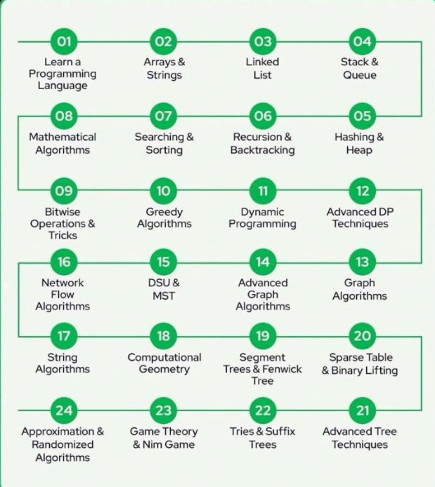

# 🚀 DSA Interview Questions

Welcome to the **DSA Interview Questions** repository — your ultimate guide to mastering Data Structures and Algorithms (DSA) for coding interviews!

---

<h2 align="center">🚀 DSA Roadmap</h2>

    
  📘 <b>DSA Sheet Link:</b> 
  <a href="https://docs.google.com/spreadsheets/u/0/d/1mvlc8EYc3OVVU3X7NKoC0iZJr_45BL_pVxiJec0r94c/htmlview" target="_blank">
    Click here to open
  </a>

<!-- 📘 **DSA Sheet Link:** [Click here to open](https://docs.google.com/spreadsheets/u/0/d/1mvlc8EYc3OVVU3X7NKoC0iZJr_45BL_pVxiJec0r94c/htmlview) -->

---

## 🎯 Why This Repository?

- Comprehensive collection of **commonly asked interview questions** on Data Structures & Algorithms.
- Solutions explained with **clean, efficient, and optimized code**.
- Helps you **prepare confidently** for technical interviews at top companies like Google, Amazon, Microsoft, and more.
- Covers a wide range of topics including Arrays, Linked Lists, Trees, Graphs, Dynamic Programming, and more.
- Written in multiple languages (e.g., Python, C++, Java) to suit your preference.

---

## 📚 DSA Questions Asked in Interviews

| Website                   | Link                                                                                      |
| ------------------------- | ----------------------------------------------------------------------------------------- |
| Take U Forward            | [Link](https://takeuforward.org/strivers-a2z-dsa-course/strivers-a2z-dsa-course-sheet-2/) |
| DSA 20 Essential Patterns | [Link](https://codolio.com/question-tracker/sheet/20-essential-dsa-patterns-by-kushal)    |

---

## 📚 Topics Covered

| Topic                    | Description                                      |
| ------------------------ | ------------------------------------------------ |
| Arrays                   | Basic to advanced array problems                 |
| Linked Lists             | Singly, Doubly, Circular Linked Lists            |
| Stacks & Queues          | Implementation and common problems               |
| Trees & Binary Trees     | Traversals, BST, Segment Trees                   |
| Graphs                   | BFS, DFS, Shortest Path Algorithms               |
| Sorting & Searching      | Binary Search, Quick Sort, Merge Sort            |
| Dynamic Programming      | Memoization, Tabulation techniques               |
| Recursion & Backtracking | Classic problems like permutations, combinations |
| Hashing                  | Hashmaps, frequency counters                     |

---

## 🎯 Interview Test Series

| 📌 Resource Name               | 🔗 Link                                                                                                                        |
| ------------------------------ | ------------------------------------------------------------------------------------------------------------------------------ |
| Mock Tests                     | [Explore](https://www.lets-code.co.in/dashboard/mocktest/)                                                                     |
| Previous Year Coding Questions | [Explore](https://www.lets-code.co.in/previousyearcodingquestion/pyqs/)                                                        |
| Interview Questions            | [Explore](https://www.lets-code.co.in/interview/interviewquestions/)                                                           |
| Placement Materials            | [Explore](https://www.lets-code.co.in/articles/free-placement-google-drive-links/)                                             |
| Complete Interview Preparation | [Explore](https://docs.google.com/document/d/1wT7H71M7CghUwB9zdFS0yp_uPccOhqWYFdf_PHPfEFI/edit?tab=t.0#heading=h.sz6llxaebnk3) |

---

## 🖥️ Practice Problem Platforms

- [LeetCode](https://leetcode.com/problemset/)
- [GeeksforGeeks](https://www.geeksforgeeks.org/explore?page=1&sortBy=submissions)
- [InterviewBit](https://www.interviewbit.com/courses/programming/)
- [Codeforces](https://codeforces.com/problemset/)

---

## 🔒 Private Repository Notice

**This is a private repository.**  
If you're interested in accessing the content, **please follow the profile and send me a request**.

I’ll review and grant access to genuine learners or collaborators.

## Thank you for your interest and support!
